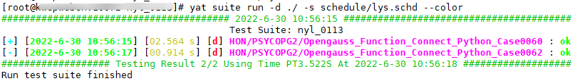

版权所有 © 2022 openGauss社区 您对“本文档”的复制、使用、修改及分发受知识共享(Creative Commons)署名—相同方式共享4.0国际公共许可协议(以下简称“CC BY-SA 4.0”)的约束。为了方便用户理解，您可以通过访问[*https://creativecommons.org/licenses/by-sa/4.0/*](https://gitee.com/link?target=https%3A%2F%2Fcreativecommons.org%2Flicenses%2Fby-sa%2F4.0%2F) 了解CC BY-SA 4.0的概要 (但不是替代)。CC BY-SA 4.0的完整协议内容您可以访问如下网址获取：[*https://creativecommons.org/licenses/by-sa/4.0/legalcode*](https://gitee.com/link?target=https%3A%2F%2Fcreativecommons.org%2Flicenses%2Fby-sa%2F4.0%2Flegalcode)。

### 1 测试用例代码提交规范

+ 提交主题需要一句话概括本次修改的内容

+ 在说明中需要针对本次提交，进行详细描述。例如：增加了什么特性的用例，覆盖了哪些方面的功能等信息

+ 文件列表需包含本次新增/修改/删除的testcase测试用例，以及与之对应的expect文件（*仅sql用例涉及*）。另外，需包含更新后的schedule文件和测试用例连跑通过截图（*如下图*）

  

+ 每次提交包含的sql文件数不超过20个，expect文件数不超过20个，python/java等文件数不超过10个，总的代码行更新（新增+修改+删除）不超过1000行

+ 提交的文件中不能包含恶意、保密或无关信息

+ 通过社区门禁检查，包括codecheck检查（*Yat仓库已对接codecheck*）和**功能检查**，旨在保证合入代码的规范性和有效性

  > 说明：功能检查包含schedule检查、sql用例格式检查和测试用例正确性检查。详见门禁说明。

### 2 非测试用例代码提交规范

+ 提交主题需要一句话概括本次修改的内容
+ 在说明中需要针对本次提交，进行详细描述。例如：修改了什么，为什么修改等信息
+ 提交的文件中不能包含恶意、保密或无关信息
+ 通过社区门禁检查，包括codecheck检查（*Yat仓库已对接codecheck*）

